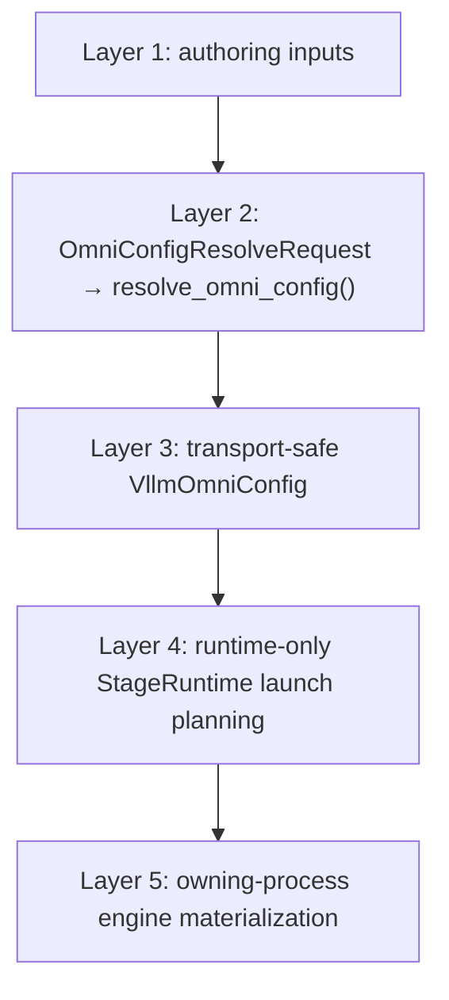

# vLLM-Omni Architecture

## Contents

- [Source of truth](#source-of-truth)
- [Layered configuration architecture](#layered-configuration-architecture)
- [Ownership and execution flow](#ownership-and-execution-flow)
- [Module map](#module-map)
- [Critical boundaries](#critical-boundaries)
- [Architecture review workflow](#architecture-review-workflow)
- [Code patterns for review](#code-patterns-for-review)

## Source of truth

Use this file as a compact routing map, not as a second architecture contract.
When the reviewed branch contains `docs/design/module/**`, map changed paths to
the matching module document by its `primary_code_paths` and
`related_code_paths` metadata, then apply these rules:

- `status: normative` — treat its invariants as review requirements.
- `status: draft` — treat its invariants as candidate guidance and verify them
  against code, tests, and module-owner discussion before blocking a PR.
- Missing module document — use this map, inspect adjacent code and tests, and
  flag the documentation gap for architecture-affecting changes.

Do not copy detailed class behavior into this reference. Link review findings
to the owning module document and stable invariant ID when available.

## Layered configuration architecture

This is the target contract for configuration changes. It gives each concern
one owner and one transition boundary. Treat compatibility code as transitional:
it must converge on this flow rather than create another resolution or
materialization path.

Treat this target as normative for configuration refactors, even while a
matching module design document is draft. A divergent change needs an explicit
design decision and a synchronized module-document update.



### Layer 1: Authoring inputs

Authoring inputs describe intent; they do not allocate runtime resources or
construct engine objects.

| Input | Owns |
|---|---|
| `PipelineConfig` | Frozen stage topology, execution types, model capabilities, and stage relationships |
| `DeployConfig` | Placement, replicas, devices, environment, deploy-time defaults, and connector definitions |
| CLI or Python overrides | Explicit caller overrides that participate in documented precedence |
| HF or diffusion model metadata | Model facts used during resolution |
| Legacy YAML adapter | Migration-only input for models that have not reached `PipelineConfig` + `DeployConfig` parity |

Do not add new model behavior to the legacy YAML adapter. Remove it once every
model has typed-config parity.

### Layer 2: Unique resolution boundary

`OmniConfigResolveRequest` is the sole input to `resolve_omni_config()`. The
resolver selects exactly one source path, loads model metadata once, applies
precedence and per-stage overrides once, resolves connectors, requests,
runtime placement, and engine specifications, then validates the complete
pipeline before any managed runtime process starts.

No entrypoint, runtime, worker, connector, or model loader may independently
reinterpret raw authoring input. A compatibility adapter may construct an
`OmniConfigResolveRequest`; it may not bypass the resolver or perform a second
merge.

### Layer 3: Resolved, transport-safe control-plane config

`resolve_omni_config()` returns a complete `VllmOmniConfig` that can cross the
orchestrator/process boundary without device-local state:

```text
VllmOmniConfig
├── pipeline_config: PipelineConfig
├── orchestrator_config: VllmOmniOrchestratorConfig
└── stage_configs: tuple[VllmOmniStageConfig, ...]
    ├── stage_pipeline_config: StagePipelineConfig
    ├── runtime_config: OmniStageRuntimeConfig
    ├── connector_config: OmniStageConnectorConfig
    ├── request_config: OmniStageRequestConfig
    └── engine_spec
        ├── EngineArgs for LLM_AR and LLM_GENERATION
        └── un-enriched OmniDiffusionConfig for DIFFUSION
```

This layer owns resolved intent, not process-local objects. It must not contain
`VllmConfig`, loaded model metadata, device handles, worker state, or
`ReplicaInitPlan`. Keep a diffusion `OmniDiffusionConfig` un-enriched until
the owning process materializes it.

### Layer 4: Runtime-only launch planning

`StageRuntime` consumes resolved stage configuration to expand replicas,
allocate devices, and choose local or remote launch. It owns launch mechanics,
not precedence or raw input interpretation. If retained, `ReplicaInitPlan` is
private runtime state and must not become a field of `VllmOmniConfig` or cross
a control-plane transport boundary.

### Layer 5: Owning-process materialization

Only `materialize_engine_config(stage)` in the owning process may turn an
engine specification into a runtime engine configuration:

| Stage type | Transport-safe engine spec | Owning-process result |
|---|---|---|
| `LLM_AR`, `LLM_GENERATION` | `EngineArgs` | `VllmConfig`, then a vLLM-backed engine |
| `DIFFUSION` | Un-enriched `OmniDiffusionConfig` | Enriched `OmniDiffusionConfig`, then a diffusion engine |

Do not materialize a `VllmConfig` before process ownership is known, serialize
an enriched diffusion config, or provide a second engine-construction helper
outside this boundary.

### Configuration review invariants

Review configuration changes against these invariants:

1. One pipeline construction uses one `OmniConfigResolveRequest` and one call
   to `resolve_omni_config()`.
2. Model metadata is loaded once by the resolver; downstream code consumes the
   resolved result.
3. Precedence, stage overrides, connector selection, request configuration,
   and placement are resolved once and validated together.
4. `VllmOmniConfig` remains complete and safe to transport; runtime plans and
   engine instances stay out of it.
5. `StageRuntime` owns replica expansion and launch placement only.
6. The owning process alone materializes `VllmConfig` or enriches an
   `OmniDiffusionConfig`.
7. Legacy YAML is migration-only and has a deletion condition: typed-config
   parity for every supported model.

Require focused evidence for changes to this flow: precedence conflicts,
single metadata loading, invalid topology before launch, resolved-config
serialization, per-stage connector and placement resolution, and AR/diffusion
materialization in the owning process.

## Overview

vLLM-Omni extends vLLM with multi-stage and multi-modality execution for text,
image, video, and audio workloads. It has two runtime families: autoregressive
execution built on vLLM scheduler and worker contracts, and a diffusion runtime
with its own scheduler, executors, workers, and model pipelines.

**Key Differentiators from vLLM:**
- Multi-stage orchestration across heterogeneous runtime families
- Explicit input, output, and modality contracts across stage boundaries
- Inter-stage transport through pluggable OmniConnector implementations
- Hardware-specific execution isolated under `vllm_omni/platforms/`
- Cross-cutting cache, quantization, observability, and profiling modules

---

## Ownership and execution flow

```
Public API / CLI
`vllm_omni/entrypoints/`
        │
        ├── normalize through config and I/O contracts
        │   `config/`, `inputs/`, `outputs/`
        ▼
Cross-stage orchestration
`engine/`, `distributed/omni_coordinator/`, `distributed/ray_utils/`
        │
        ├── autoregressive path ── `core/sched/` → `worker/`
        │
        └── diffusion path ─────── `diffusion/sched/` →
                                    `diffusion/executor/` and
                                    `diffusion/worker/`
        │
        ├── model execution ────── `model_executor/` or
        │                           `diffusion/models/`
        │
        └── inter-stage transfer ─ `distributed/omni_connectors/`

Cross-cutting: `platforms/`, cache, quantization, metrics, and profilers
```

---

## Module map

| Module contract | Primary paths | Ownership and review focus | Validation paths |
|---|---|---|---|
| Entrypoints | `vllm_omni/entrypoints/**` | Adapt public protocols; validate and convert requests; preserve streaming identity; do not own cross-stage routing or model-specific policy | `tests/entrypoints/**` |
| Configuration | `vllm_omni/config/**`, `vllm_omni/deploy/**`, `vllm_omni/entrypoints/utils.py`, `vllm_omni/engine/stage_runtime.py` | Preserve the layered configuration contract: resolve authoring inputs once into transport-safe `VllmOmniConfig`; keep replica planning runtime-private and materialize engine config only in the owning process | `tests/config/**`, affected launch tests |
| I/O and modality contracts | `vllm_omni/inputs/**`, `vllm_omni/outputs/**`, `vllm_omni/request.py`, `vllm_omni/data_entry_keys.py`, `vllm_omni/errors.py` | Preserve request identity and explicit modality across conversion, transfer, streaming, cancellation, and errors | `tests/inputs/**`, affected integration tests |
| Engine orchestration | `vllm_omni/engine/**`, `vllm_omni/distributed/omni_coordinator/**`, `vllm_omni/distributed/ray_utils/**` | Own cross-stage routing, lifecycle, ordering, cancellation, failure propagation, startup, and shutdown | `tests/engine/**`, `tests/distributed/omni_coordinator/**` |
| OmniConnector | `vllm_omni/distributed/omni_connectors/**`, `vllm_omni/platforms/*/omni_connectors/**` | Transport and synchronize data without choosing stages or model policy; define completion, timeout, backpressure, and cleanup | `tests/distributed/omni_connectors/**` |
| Autoregressive runtime | `vllm_omni/core/**`, `vllm_omni/worker/**` | Preserve upstream scheduling semantics; schedulers own request state; workers execute assigned work and do not route stages | `tests/core/**`, `tests/worker/**` |
| Model integration | `vllm_omni/model_executor/**`, `vllm_omni/model_extras/**`, `vllm_omni/plugins/**` | Register and load models through explicit selection boundaries; keep model-specific code out of orchestration | `tests/model_executor/**`, affected model tests |
| Diffusion runtime | `vllm_omni/diffusion/diffusion_engine.py`, `vllm_omni/diffusion/sched/**`, `vllm_omni/diffusion/executor/**`, `vllm_omni/diffusion/worker/**`, `vllm_omni/diffusion/ipc.py` | Keep one scheduler-owned request lifecycle; executors and workers follow scheduler output; release all request resources on terminal paths | `tests/diffusion/**` |
| Diffusion model integration | `vllm_omni/diffusion/models/**`, `model_loader/**`, `hooks/**`, `layers/**`, `postprocess/**`, `attention/**`, `lora/**`, `registry.py` | Select pipelines through the registry; keep admission, batching, cancellation, and scheduling out of model code | `tests/diffusion/models/**`, `tests/diffusion/model_loader/**`, affected subsystem tests |
| Execution platforms | `vllm_omni/platforms/**`, related `vllm_omni/attention/**` | Isolate hardware capability detection and overrides; keep portable modules free of direct vendor imports | `tests/platforms/**` plus device-specific tests |
| Cache management | `vllm_omni/core/prefix_cache.py`, `vllm_omni/experimental/ar_diffusion/kv_cache/**`, `vllm_omni/diffusion/cache/**`, connector KV transfer | Define complete cache identity, ownership, validity, eviction, and terminal cleanup; preserve a correct disabled path | `tests/core/**`, `tests/diffusion/cache/**`, connector tests |
| Quantization | `vllm_omni/quantization/**`, `vllm_omni/diffusion/quantization/**`, `vllm_omni/platforms/*/quant/**` | Validate checkpoint, method, layer, and device compatibility; never silently fall back to another precision | `tests/quantization/**`, `tests/diffusion/quantization/**` |
| Observability | `vllm_omni/metrics/**`, `vllm_omni/logger.py` | Preserve metric meaning and request correlation; keep labels bounded and user payloads out of logs | `tests/metrics/**` |
| Profiling and benchmarking | `vllm_omni/profiler/**`, `vllm_omni/diffusion/profiler/**`, `vllm_omni/benchmarks/**`, `vllm_omni/entrypoints/cli/benchmark/**`, `benchmarks/**` | Keep profiling opt-in and semantics-preserving; make benchmarks reproducible and correctness-aware | `tests/profile/**`, `tests/benchmarks/**`, `tests/dfx/perf/**` |

---

## Core Components

### Entry Points

**Synchronous:** `Omni` class
```python
from vllm_omni import Omni
llm = Omni(model="Qwen/Qwen2.5-Omni-7B")
outputs = llm.generate("Hello")
```

**Asynchronous:** `AsyncOmni` class
```python
from vllm_omni import AsyncOmni
llm = AsyncOmni(model="Qwen/Qwen2.5-Omni-7B")
outputs = await llm.generate("Hello")
```

### Stage Types

| Runtime family | Main scheduler / engine | Execution boundary |
|---|---|---|
| Autoregressive | `OmniARScheduler`, `OmniARAsyncScheduler` | `GPUARWorker` and model runners under `model_executor/` |
| One-step generation | `OmniGenerationScheduler` | `GPUGenerationWorker` and model runners under `model_executor/` |
| Diffusion | `DiffusionEngine` and `diffusion/sched/**` | `diffusion/executor/**`, `diffusion/worker/**`, and registered pipelines |

### Connectors

All implementations derive from `OmniConnectorBase`. Current implementations
include `SharedMemoryConnector`, `MooncakeStoreConnector`,
`MooncakeTransferEngineConnector`, `MoriTransferEngineConnector`, and
`YuanrongConnector`, with hardware-specific connectors under
`vllm_omni/platforms/*/omni_connectors/`.

Review the interface and producer/consumer contract, not just the selected
backend. Verify identity, shape, dtype, placement, ownership, completion,
timeout, cancellation, error propagation, and cleanup at both ends.

---

## Multi-Stage Pipeline

### Example: Qwen-Omni Audio Generation

```
┌─────────┐     ┌─────────┐     ┌───────────┐
│ Thinker │ ──▶ │ Talker  │ ──▶ │ Code2Wav  │
│ (LLM)   │     │ (LLM)   │     │ (Audio)   │
└─────────┘     └─────────┘     └───────────┘
     │               │                │
   Text/Audio     Text Code      Audio Output
   Understanding  Generation     Synthesis
```

### Configuration (YAML)

```yaml
stages:
  - name: thinker
    type: llm
  - name: talker
    type: llm
  - name: code2wav
    type: audio
```

---

## Critical boundaries

```
Entrypoint ──validated request──▶ Orchestrator ──stage assignment──▶ Runtime
     ▲                                  │                              │
     │                                  └── routing and lifecycle      │
     │                                                                 ▼
Public response ◀──output conversion── Stage output ◀──execution── Worker/model
                                             │
                                      OmniConnector transfer
```

Review these boundaries before local implementation details:

1. **Entrypoint → internal contract:** validate once; do not leak protocol or
   model-specific policy into orchestration.
2. **Orchestrator → runtime:** the orchestrator owns routing and stage
   lifecycle; schedulers own admitted request state.
3. **Scheduler → worker/model:** execution follows scheduler output; workers and
   models do not choose downstream stages.
4. **Producer → connector → consumer:** both ends agree on data and completion
   semantics; connectors do not own routing policy.
5. **Terminal path:** success, cancellation, failure, and shutdown converge on
   complete cleanup and monotonic terminal state.

## Architecture review workflow

1. Map every changed production path to one primary module and any
   cross-cutting modules in `docs/design/module/**`.
2. Read each matched module's boundary, dependencies, invariants, and
   validation paths. Record the invariant IDs checked.
3. Trace the changed behavior through every producer-consumer boundary; inspect
   both sides of connector, serialization, registry, and config changes.
4. Verify ownership has not moved silently. A boundary change requires explicit
   design agreement and synchronized module documentation.
5. Require evidence from the mapped validation paths. For lifecycle changes,
   cover success, cancellation, failure, and shutdown; for distributed changes,
   cover the affected rank topology and a supported single-rank path.
6. Report architecture findings as: violated boundary or invariant, concrete
   failure mode, required evidence or design decision, and next action.

## Cross-cutting state

### KV Cache (LLM Stages)
- Preserve upstream vLLM allocation and request-state semantics unless the PR
  explicitly changes the contract.
- Keep allocation, reuse, transfer, eviction, and cleanup ownership explicit.
- Include every correctness-affecting input in cache identity.

### Diffusion Latent Cache
- Preserve a correct cache-disabled path.
- Never reuse state across incompatible requests, timesteps, models, dtypes,
  devices, or parallel layouts.
- Release request-scoped entries on every terminal path.

---

## Model selection boundaries

Do not maintain a model list in this reference; it becomes stale quickly.
Inspect the registries on the reviewed branch:

- Autoregressive and omni models:
  `vllm_omni/model_executor/models/registry.py`
- Diffusion pipelines: `vllm_omni/diffusion/registry.py`

Registration is the selection boundary. Verify that configuration, registry,
exports, loader, processor, and tests agree, and that model code does not route
or schedule requests.

---

## Review Considerations

### Critical Paths (High Impact)
- `vllm_omni/engine/` and `distributed/omni_coordinator/` — routing,
  cancellation, ordering, startup, and shutdown affect multi-stage workloads.
- `vllm_omni/core/` and `vllm_omni/worker/` — scheduler and worker changes can
  violate upstream request-state and execution contracts.
- `vllm_omni/distributed/omni_connectors/` — transfer mismatches and incomplete
  cleanup cause corruption, hangs, and leaks.
- `vllm_omni/diffusion/{sched,executor,worker}/` and
  `diffusion_engine.py` — lifecycle or batching changes affect every diffusion
  pipeline.
- `vllm_omni/inputs/`, `outputs/`, `request.py`, and `data_entry_keys.py` —
  contract drift breaks stage and public API boundaries.
- `vllm_omni/config/` and stage configs — invalid topology or precedence must
  fail before managed processes start.

### High-Risk Patterns
1. **Stage coordination changes** — can break multi-stage pipelines
2. **Memory management in connectors** — shared memory leaks
3. **Scheduler or worker lifecycle changes** — can strand request or cache state
4. **Producer-consumer contract changes** — can corrupt cross-stage payloads
5. **Input validation gaps** — engine crashes instead of actionable client errors
6. **Platform imports in portable modules** — break non-target backends
7. **Model-specific routing outside registries and processors** — duplicates
   orchestration policy

### Testing Requirements
| Component | Test Requirement |
|-----------|------------------|
| Entrypoints and I/O | Success, invalid input, serialization, streaming, cancellation, and error mapping |
| Engine and coordinator | Routing, ordering, lifecycle, failure propagation, startup, and shutdown |
| AR scheduler and workers | Affected unit tests plus representative inference; preserve upstream semantics |
| Diffusion runtime | Scheduler/executor tests, output correctness, cancellation, cleanup, and representative generation |
| Connectors | Both endpoints, timeout, cancellation, failure, multi-rank behavior, and leak/cleanup checks |
| Model integration | Registry, loading, input conversion, baseline correctness, and representative inference |
| Platform-specific code | Common import path plus affected device tests in a fresh `uv` environment |
| Cache or quantization | Disabled/reference path, correctness or accuracy comparison, memory evidence, and incompatible-input rejection |

---

## Code patterns for review

*This section holds the former standalone `code-patterns.md` material (async, validation, connectors, logging, etc.).*

### Async Function Complexity

**Guidelines:**
- Each `await` is a potential failure point and state transition
- Consider splitting long async chains into smaller helpers
- Watch for race conditions in complex async flows
- Use `return_exceptions=True` for parallel operations

**Good:**
```python
async def process_batch(requests: list[Request]) -> list[Response]:
    validated = [_validate_request(r) for r in requests]
    results = await asyncio.gather(
        *[_process_single(r) for r in validated],
        return_exceptions=True
    )
    return [_handle_result(r) for r in results]
```

**Bad:**
```python
async def process_batch(requests: list[Request]) -> list[Response]:
    results = []
    for r in requests:
        results.append(await _process_single(r))  # Sequential, no error handling
    return results
```

---

### Distributed Execution Patterns

**When complexity is justified:**
- Tensor parallelism synchronization across workers
- Pipeline parallelism stage coordination
- Distributed KV cache management
- Multi-node communication patterns

**Critical questions:**
- Is distributed complexity isolated from business logic?
- Are distributed failure modes handled?
- Is there a clear fallback for single-device execution?

**Pattern:**
```python
def get_world_size() -> int:
    """Returns 1 if not in distributed mode."""
    if not dist.is_initialized():
        return 1
    return dist.get_world_size()
```

---

### KV Cache Management

**Guidelines:**
- Ensure clear separation between allocation, update, and cleanup
- Document invariants and assumptions
- Use type system to enforce valid states
- Always handle cleanup in error paths

**Pattern:**
```python
class KVCache:
    def allocate(self, num_blocks: int) -> None:
        assert self._state == CacheState.UNINITIALIZED
        self._blocks = [Block() for _ in range(num_blocks)]
        self._state = CacheState.ALLOCATED

    def update(self, block_id: int, kv_data: Tensor) -> None:
        assert self._state == CacheState.ALLOCATED
        self._blocks[block_id].update(kv_data)

    def free(self) -> None:
        self._blocks = []
        self._state = CacheState.UNINITIALIZED
```

---

### Input Validation Pattern

**Guidelines:**
- Validate early (API layer, not engine)
- Return actionable error messages
- Use clean HTTP status codes (400 for client errors)

**Pattern:**
```python
def _validate_request(self, request: Request) -> str | None:
    """Returns error message or None if valid."""
    if not request.input:
        return "Input cannot be empty"

    if request.param and request.param not in VALID_PARAMS:
        return f"Invalid param '{request.param}'. Valid: {VALID_PARAMS}"

    return None

def handle_request(self, request: Request) -> Response:
    error = self._validate_request(request)
    if error:
        return Response(status_code=400, content={"error": error})
    return self._process(request)
```

---

### Connector Communication

**Guidelines:**
- Use context managers for resource cleanup
- Handle timeouts explicitly
- Implement proper error propagation

**Pattern:**
```python
async def send_to_next_stage(self, data: Tensor) -> None:
    try:
        async with self.connector.acquire(timeout=30.0) as channel:
            await channel.send(data)
    except TimeoutError:
        logger.error("Stage communication timeout")
        raise StageError("Downstream stage unavailable")
    except Exception as e:
        logger.error(f"Stage communication failed: {e}")
        raise
```

---

### Stage Lifecycle

**Guidelines:**
- Stages are configured at init time
- Runtime reconfiguration requires full teardown
- State must be properly managed across stage boundaries

**Pattern:**
```python
class Stage:
    def __init__(self, config: StageConfig):
        self._validate_config(config)
        self.config = config
        self._state = StageState.INITIALIZED

    async def start(self) -> None:
        assert self._state == StageState.INITIALIZED
        await self._allocate_resources()
        self._state = StageState.RUNNING

    async def stop(self) -> None:
        if self._state == StageState.RUNNING:
            await self._release_resources()
        self._state = StageState.STOPPED
```

---

### Test Coverage Requirements

| Code Type | Requirement |
|-----------|-------------|
| New features | Happy path + edge cases + error handling |
| Bug fixes | Regression test + edge cases around fix |
| Performance | Benchmarks with before/after measurements |
| Distributed | Must test in distributed mode |
| Quantization | Memory savings + quality impact measured |
| API endpoints | Input validation + error responses |

---

### Code Quality Thresholds

| Metric | Threshold | Action |
|--------|-----------|--------|
| Function length | 100+ lines | Review for split opportunities |
| Complexity | 11+ | Requires refactoring |
| Nesting depth | 4+ levels | Requires refactoring |
| Parameters | 7+ | Consider parameter object |

---

### Error Handling Pattern

**Guidelines:**
- Use specific exception types
- Include actionable context in messages
- Don't silently swallow errors

**Pattern:**
```python
class ValidationError(Exception):
    """Raised when input validation fails."""
    pass

class EngineError(Exception):
    """Raised when engine operation fails."""
    pass

def process(self, request: Request) -> Response:
    try:
        return self._process_internal(request)
    except ValidationError as e:
        logger.warning(f"Validation failed: {e}")
        return Response(status_code=400, content={"error": str(e)})
    except EngineError as e:
        logger.error(f"Engine error: {e}")
        return Response(status_code=500, content={"error": "Internal error"})
```

---

### Logging Pattern

**Guidelines:**
- Use appropriate log levels
- Include relevant context
- Avoid logging sensitive data

```python
# Good
logger.info(f"Processing request {request_id} with model {model_name}")
logger.warning(f"Slow response time: {elapsed_ms}ms for {endpoint}")
logger.error(f"Failed to load model {model_path}: {e}")

# Bad
logger.info("Processing request")  # No context
print(f"Error: {e}")  # Wrong logging method
logger.debug(f"User token: {token}")  # Sensitive data
```
